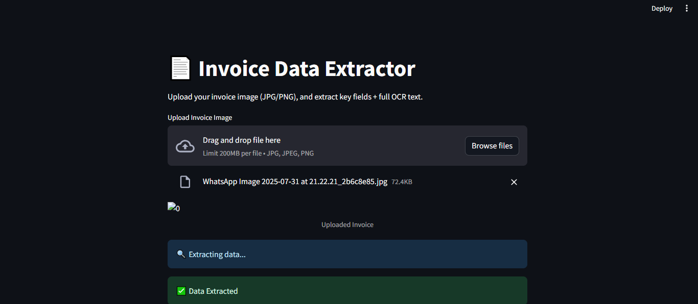
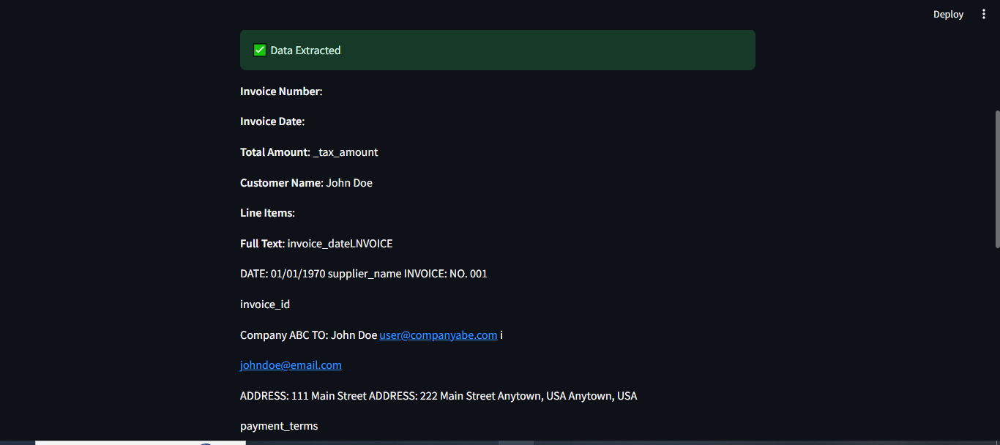

# Invoice Data Extractor (OCR)

Extract Invoice Number, Date, Total, Customer Name, and Line Items using Tesseract OCR and Streamlit.

---

## 📁 Folder Structure

```
invoice-ocr-extractor/
├── app.py
├── extractor.py
├── utils.py
├── requirements.txt
├── output_images/
│   ├── output1.png
│   ├── output2.png
│   └── output3.png
```

---

## ✅ 1. Setup (Windows)

### 🔹 Install Python packages
```bash
pip install -r requirements.txt
```

### 🔹 Install Tesseract OCR

- Download from: https://github.com/UB-Mannheim/tesseract/wiki
- Install to: `D:\Tesseract-OCR`

### 🔹 Add this line in `extractor.py`:
```python
pytesseract.pytesseract.tesseract_cmd = r'D:\Tesseract-OCR\tesseract.exe'
```

---

## ✅ 2. Run the App

```bash
streamlit run app.py
```

---

## ✅ 3. Output Example

Sample extracted fields will be saved to:
```
extracted_invoices.csv
```

Sample output screenshots/images are in:





